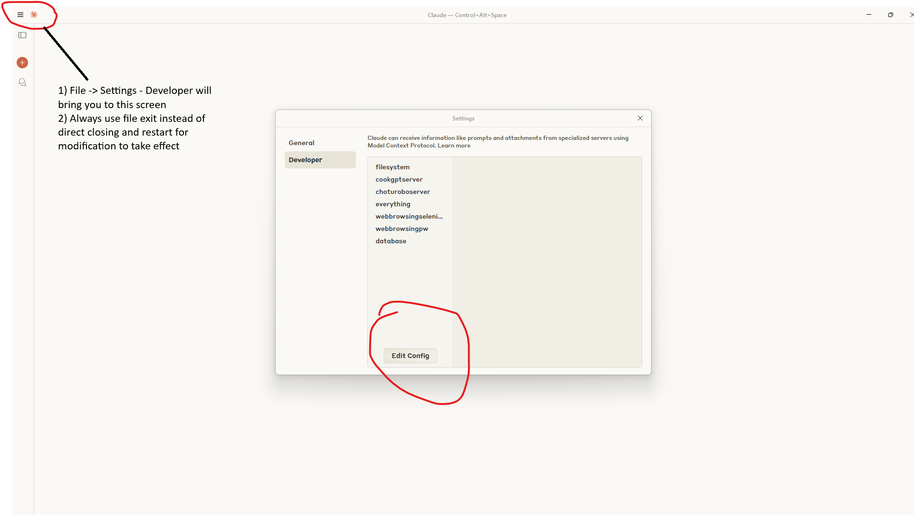
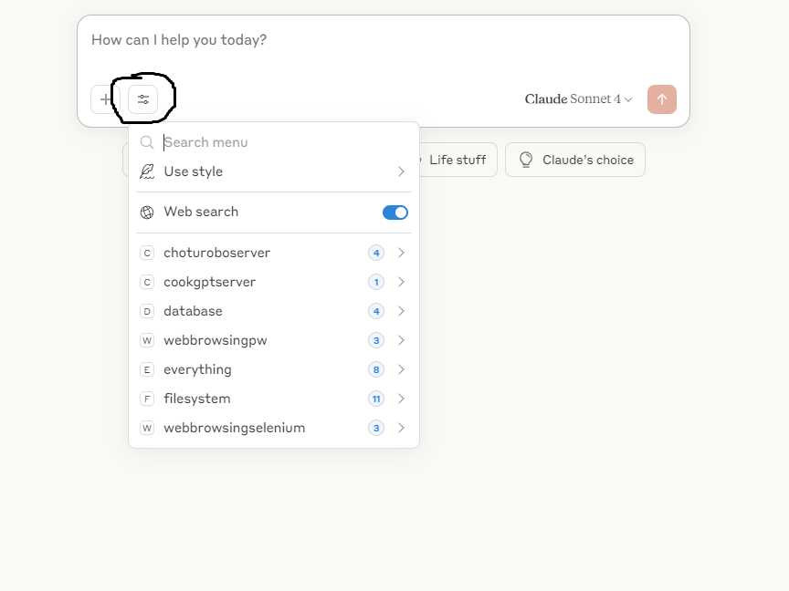

# Build MCP server in Java with a2ajava

This guide will help you set up your development environment building MCP Server, including both MCP (Model Context Protocol) and A2A (Agent-to-Agent) servers.

## Prerequisites
- Java Development Kit (JDK) 11 or higher
- IntelliJ IDEA (recommended) or your preferred IDE
- Claude Desktop Client
- Git

## Setup Steps

### 1. Fork and Clone the Server Repository
Fork the [SpringActions repository](https://github.com/vishalmysore/SpringActions) to your GitHub account. This will serve as your MCP/A2A server that can handle both protocols.

### 2. Download the MCP Connector
Download the [MCP Connector JAR](https://github.com/vishalmysore/mcp-connector/releases/download/release2/mcp-connector-full.jar). This is a mandatory component that enables communication between your client and server for MCP protocol , for A2A this is not required.

### 3. (Optional) Clone the MCP Connector Source
If you want to examine or modify the connector's source code:
```bash
git clone https://github.com/vishalmysore/mcp-connector
```
Open the project in IntelliJ IDEA to explore or modify the connector code.

### 4. Install Claude Desktop Client
1. Download and install the Claude Desktop Client from [claude.ai/download](https://claude.ai/download)
2. Complete the installation process for your operating system

### 5. Start the Server
1. Open the SpringActions project in your IDE
2. Run the main application file: [Application.java](https://github.com/vishalmysore/SpringActions/blob/main/src/main/java/io/github/vishalmysore/Application.java)
3. Verify the server is running by accessing:
   ```
   http://localhost:7860
   ```

### 6. Configure Claude Desktop Client

1. Locate your Claude configuration file:
   ```
   C:\Users\<yourusername>\AppData\Roaming\Claude\claude_desktop_config.json
   ```

2. Add the following server configuration to the file:
   ```json
   "mycustomserver": {
     "command": "java",
     "args": [
       "-jar",
       "PATH_TO_YOUR_JAR/mcp-connector-full.jar",
       "http://localhost:7860"
     ],
     "timeout": 30000
   }
   ```
   > Replace `PATH_TO_YOUR_JAR` with the actual path where you saved the mcp-connector-full.jar from step 2.

   

3. Restart Claude Desktop:
   - Go to File > Exit (Do not use the close button)
   - Relaunch the application

4. Verify the setup:
   - The new tool should appear in your Claude Desktop client
   - 

## Testing the Setup

To verify everything is working correctly:
1. Open Claude Desktop Client
2. Type a test command like "what food vishal likes" , will trigger action from https://github.com/vishalmysore/SpringActions/blob/main/src/main/java/io/github/vishalmysore/service/SimpleService.java
3. The tool should be invoked and return a response

## Troubleshooting

If you encounter issues:
1. Verify the server is running on port 7860
2. Check the connector JAR path in your Claude configuration
3. Ensure you've properly restarted the Claude Desktop Client
4. Check the logs for any error messages

